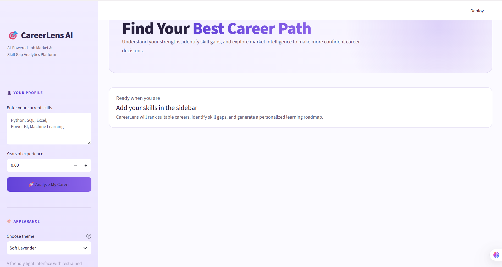
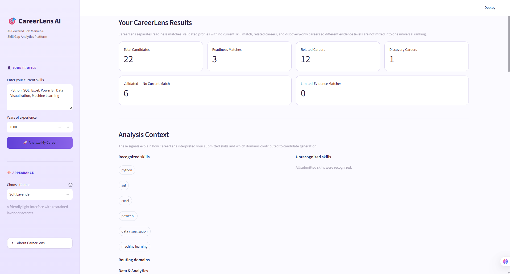
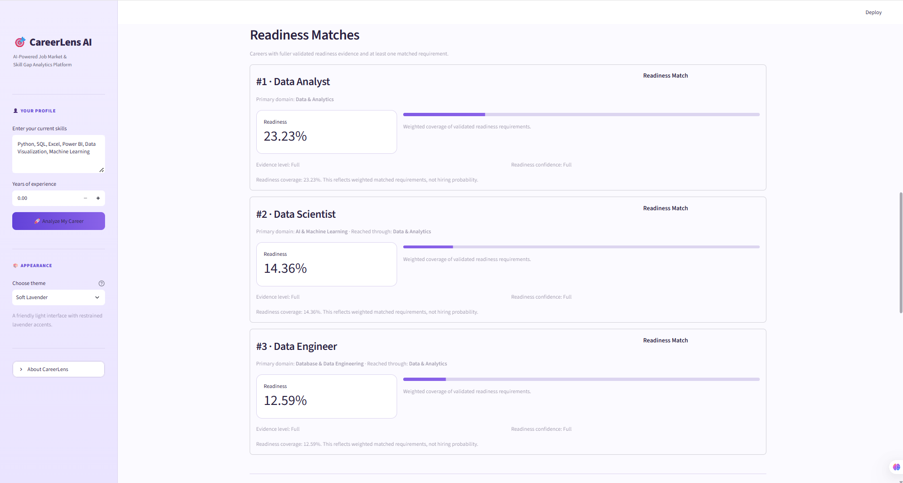
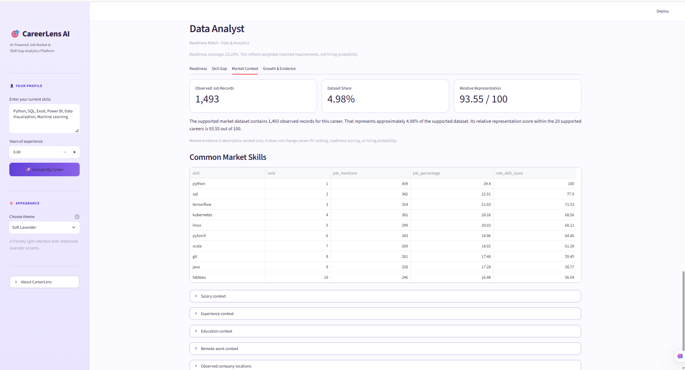
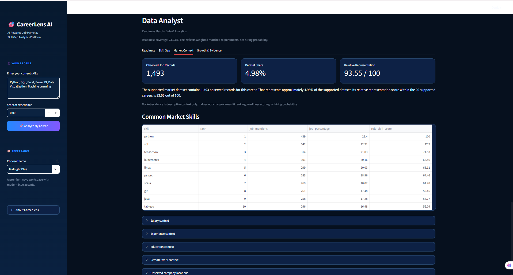

# CareerLens AI

> An explainable AI-powered career intelligence and skill-gap analytics platform for discovering relevant career paths, assessing skill readiness, and identifying learning priorities.

CareerLens AI analyzes a user's skills against structured career profiles and career-domain evidence to identify relevant career paths. Instead of treating career recommendation as a single black-box score, the system separates career routing, skill readiness, skill gaps, and market context so that recommendations remain interpretable.

The current CareerLens AI V2 taxonomy covers **24 career domains and 201 careers**, extending the original AI and Data-focused V1 system into a broader career intelligence platform.

---

## Screenshots

### CareerLens AI Interface

The main CareerLens AI interface allows users to enter their skills and profile information before running career analysis.



### Career Recommendations

CareerLens routes recognized skills to relevant career domains and presents career recommendations according to the evidence available for each career.



### Readiness and Skill Gap Analysis

For careers with validated readiness profiles, CareerLens shows weighted skill-requirement coverage together with matched and missing skill evidence.



### Market Intelligence

Where supported by the available job-market dataset, CareerLens provides descriptive market context separately from career readiness and ranking.



### Customizable Interface Themes

CareerLens AI includes five selectable interface themes: Light Professional, Dark Modern, Midnight Blue, Soft Lavender, and High Contrast.



## Key Features

- **201-career taxonomy across 24 career domains**

- Skill normalization and trusted skill aliases

- Career-domain routing from recognized user skills

- Career-specific readiness assessment where validated profiles are available

- Core and important skill-gap identification

- Explainable career recommendations

- Separate full-readiness and limited-readiness evidence lanes

- Related-career discovery when readiness evidence is incomplete

- Market-demand context for careers supported by the available job-market dataset

- Salary, experience, education, remote-work, and location context where supported

- Experimental job-growth information where available

- Five selectable Streamlit interface themes

- Conservative handling of unknown skills and unsupported evidence

- Preservation of the original V1 career analytics components

---

## How CareerLens AI Works

```text

User Skills

    |

    v

Skill Normalization

    |

    v

Career Domain Detection

    |

    v

Relevant Candidate Career Generation

    |

    v

Career-Specific Skill Matching

    |

    +----------------------+

    |                      |

    v                      v

Readiness Assessment    Skill Gap Analysis

    |                      |

    +----------+-----------+

               |

               v

       Evidence Enrichment

               |

               v

    Explainable Career Results

```

CareerLens uses domain detection as a **routing mechanism**, not as a career probability. Once relevant domains have been identified, candidate careers are evaluated according to the evidence available for each career.

---

## Career Domains

CareerLens AI currently organizes its career taxonomy into the following 24 domains:

| # | Career Domain | # | Career Domain |
|---|---|---|---|
| 1 | AI & Machine Learning | 13 | Human Resources |
| 2 | Banking & FinTech | 14 | Marketing & Advertising |
| 3 | Business & Consulting | 15 | Media, Content & Communication |
| 4 | Cloud Computing | 16 | Mobile Development |
| 5 | Cybersecurity | 17 | Networking & IT Infrastructure |
| 6 | Data & Analytics | 18 | Operations & Supply Chain |
| 7 | Database & Data Engineering | 19 | Product & Project Management |
| 8 | DevOps & Platform Engineering | 20 | Research & Academia |
| 9 | Education & Training | 21 | Sales & Customer Success |
| 10 | Engineering | 22 | Software Development |
| 11 | Finance & Accounting | 23 | UI/UX & Product Design |
| 12 | Healthcare & Life Sciences | 24 | Web Development |

---

## Evidence-Aware Recommendation Design

Not every career in CareerLens has the same amount or quality of supporting evidence. V2 therefore avoids forcing every career into one universal ranking.

The career profiles currently consist of:

| Profile Type | Careers | Purpose |
|---|---:|---|
| Full readiness | 58 | Stronger validated career-specific readiness assessment |
| Limited readiness | 26 | Readiness assessment with more limited supporting evidence |
| Routing only | 107 | Career discovery without a numeric readiness score |
| Safe shell | 10 | Discovery-only careers where evidence is insufficient |
| **Total** | **201** | |

This means **84 careers currently support readiness assessment**, while the remaining careers are handled conservatively through routing or discovery rather than fabricated readiness scores.

---

## Readiness Assessment

CareerLens readiness measures **weighted coverage of validated career skill requirements**.

It is **not**:

- a probability of getting hired,

- a probability of career success,

- a universal employability score, or

- a ranking that can automatically be compared across every career.

For readiness-enabled profiles, validated requirements are separated into skill tiers.

Current readiness weighting:

```text

Core skill weight      = 1.8

Important skill weight = 1.0

```

Conceptually:

```text

Readiness =

Weighted Matched Requirements

------------------------------

Weighted Total Requirements

```

Supporting, functional, and contextual evidence can help describe a career profile but does not automatically become a readiness requirement.

---

## Skill Gap Analysis

For readiness-enabled careers, CareerLens compares normalized user skills against validated career requirements.

The system identifies:

- matched core skills,

- matched important skills,

- missing core skills, and

- missing important skills.

Missing **core skills form the higher-priority group**. Missing important skills form the next group.

Within a tier, the current system does not claim to know the ideal pedagogical learning order.

---

## Career Recommendation Lanes

CareerLens separates recommendations according to evidence quality.

### Full Readiness

Careers with sufficiently validated profiles can receive a readiness score and can be ordered within the full-readiness lane.

### Limited Readiness

Careers with useful but more limited evidence may also receive readiness scores. These scores are interpreted within the limited-readiness lane rather than treated as universally comparable with full-readiness careers.

### Related Careers

Routing-only careers may be shown when the user's skills provide relevant domain evidence, but CareerLens does not fabricate a readiness score for them.

### Discovery Only

Careers with insufficient validated readiness evidence can still be surfaced for exploration without claiming a numeric match.

---

## Market Intelligence

CareerLens includes job-market context for careers supported by the available market dataset.

Supported information may include:

- relative demand,

- job count,

- market share,

- salary information,

- experience context,

- education context,

- remote-work information,

- location information, and

- experimental growth information.

### Important Evidence Limitation

The current job-market dataset is concentrated mainly around the original AI and Data career set.

Therefore:

> Missing market information means **market evidence is unavailable**, not that demand for that career is zero.

Market, salary, experience, education, remote-work, location, and experimental growth information are **descriptive context** and do not determine the CareerLens readiness ranking.

Experimental growth information is also not treated as a production-quality ranking signal.

---

## Technology Stack

### Application

- Python

- Streamlit

- Altair

### Data Processing

- Pandas

- NumPy

### Machine Learning / Model Runtime

- Joblib

- Pre-trained job-growth model

### Development

- VS Code

- Jupyter Notebook

- Git

- GitHub

---

## Project Structure

```text

CareerLens_AI/

|

|-- app/

|   `-- main.py

|

|-- data/

|   |-- processed/

|   |   `-- core_job_market_data.csv

|   |

|   |-- raw/

|   |   `-- ai_job_market_insights.csv

|   |

|   `-- reference/

|       |-- career_profiles_v2.json

|       |-- career_profiles_v2_manifest.json

|       |-- career_taxonomy.json

|       |-- domain_skill_map.json

|       |-- readiness_policy_v2.json

|       |-- recommendation_evidence_policy_v2.json

|       |-- role_skill_profiles.json

|       |-- routing_policy_v2.json

|       `-- runtime_skill_aliases_v2.json

|

|-- models/

|   `-- career_lens_job_growth_random_forest.joblib

|

|-- src/

|   |-- data/

|   |-- features/

|   |-- models/

|   `-- utils/

|

|-- .gitignore

|-- requirements.txt

`-- README.md

```

Large development datasets, external source files, intermediate processing artifacts, virtual environments, notebooks, caches, and local backup files are intentionally excluded from the public repository.

---

## Installation

### 1. Clone the repository

```bash

git clone https://github.com/charu-2009/CareerLens-AI.git

cd CareerLens-AI

```

### 2. Create a virtual environment

Windows:

```bash

python -m venv .venv

.venv\\Scripts\\activate

```

macOS/Linux:

```bash

python3 -m venv .venv

source .venv/bin/activate

```

### 3. Install dependencies

```bash

pip install -r requirements.txt

```

---

## Running CareerLens AI

From the project root:

```bash

streamlit run app/main.py

```

Streamlit will provide a local URL, normally:

```text

http://localhost:8501

```

Open it in a web browser to use CareerLens AI.

---

## Example Workflow

A typical CareerLens session follows this process:

```text

Enter Skills

     |

     v

Normalize Recognized Skills

     |

     v

Detect Relevant Career Domains

     |

     v

Generate Candidate Careers

     |

     v

Evaluate Validated Career Profiles

     |

     v

Display Readiness / Related Careers

     |

     v

Show Skill Gaps + Supporting Evidence

```

Unknown skills are preserved separately rather than silently treated as recognized evidence.

---

## Explainability and Safety Principles

CareerLens AI follows several evidence-aware design principles:

1\. Domain support is evidence for routing, not proof that a career is suitable.

2\. Readiness represents validated skill-requirement coverage.

3\. Missing readiness evidence is treated as unavailable rather than zero.

4\. Unsupported market evidence is not imputed.

5\. Routing-only and discovery-only careers do not receive fabricated readiness scores.

6\. Full and limited readiness lanes are not treated as universally cross-comparable.

7\. Market context does not determine career ranking.

8\. Experimental growth information does not determine career ranking.

9\. Career recommendations remain traceable to recognized skills and available evidence.

---

## Data and Evidence

CareerLens combines internally prepared project datasets and structured career evidence.

The system has been designed to work with career information derived during development from sources including structured occupational taxonomies and job-market datasets.

The public repository contains only the runtime artifacts required by the application. Large external source datasets and intermediate evidence-processing files are intentionally excluded.

This keeps the published application lightweight while preserving the evidence artifacts required for runtime behavior.

---

## Current Limitations

CareerLens AI is an academic and portfolio project and should not be interpreted as a professional hiring or career-assessment service.

Current limitations include:

- Market coverage is stronger for AI and Data careers than for the entire 201-career taxonomy.

- Some careers have routing evidence but insufficient evidence for readiness scoring.

- Limited-readiness scores should not be treated as directly equivalent to full-readiness scores.

- Skill matching depends on the current normalization and trusted-alias vocabulary.

- Readiness measures skill coverage rather than real-world employability.

- Experimental growth information has lower evidential confidence.

- Career outcomes depend on many factors that are outside the current system, including experience quality, portfolio strength, interview performance, location, education, and changing employer requirements.

---

## Future Development

Potential future improvements include:

- Broader job-market coverage across all career domains

- Expanded career-specific skill evidence

- Improved skill synonym and alias coverage

- Learning-resource recommendations

- Personalized learning roadmaps

- Resume-based skill extraction

- Experience-aware career analysis

- Expanded geographic labor-market intelligence

- Improved salary analytics

- Longitudinal market-trend analysis

- Additional model evaluation and calibration

- Deployment of CareerLens AI as a hosted web application

---

## Project Status

CareerLens AI V2 currently includes:

- 24 career domains

- 201 career paths

- 84 readiness-enabled career profiles

- evidence-aware career routing

- explainable readiness assessment

- skill-gap analysis

- market intelligence where supported

- Streamlit-based interactive interface

- five selectable UI themes

The core V2 recommendation, explanation, result-assembly, reporting, and user-interface layers have completed functional and semantic validation.

---

## Disclaimer

CareerLens AI is designed for educational, analytical, and career-exploration purposes.

Its outputs should be interpreted as decision-support information rather than guarantees of employment, career suitability, salary, future job growth, or professional success.

---

## Author

**Charu Jain**

B.Tech — Computer Science and Engineering

Career interests: Data Analytics, Data Science, Business Analytics and AI-driven decision-support systems.

---

## Repository

CareerLens AI  

GitHub: `charu-2009/CareerLens-AI`

